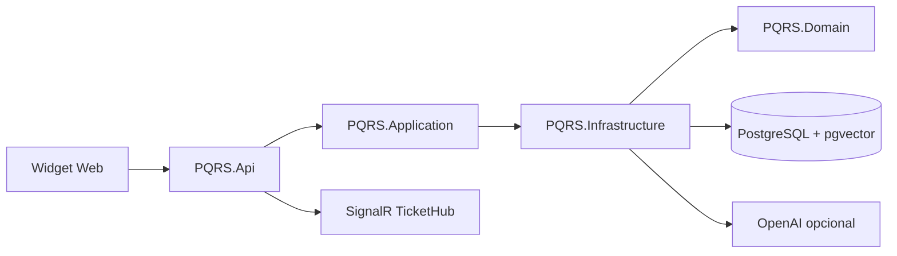

# PQRS SaaS Multi-tenant

API ASP.NET Core 8 para la gestion de Peticiones, Quejas, Reclamos y Sugerencias (PQRS), con aislamiento por tenant, PostgreSQL, pgvector, autenticacion JWT, RAG, triaje automatico, Widget Web y notificaciones SignalR.

## Arquitectura

La solucion aplica Clean Architecture:



- `PQRS.Domain`: entidades, enums y contratos de dominio.
- `PQRS.Application`: DTOs y contratos de casos de uso.
- `PQRS.Infrastructure`: EF Core/Npgsql, pgvector, JWT, PBKDF2, RAG, triaje y SignalR.
- `PQRS.Api`: controllers, middleware de tenant, archivos estaticos y configuracion HTTP.

Todas las entidades tenant-bound usan un filtro global de EF Core. El `TenantId` se resuelve por JWT (`tenant_id`), `X-Tenant-Id` o `X-API-Key`.

## Requisitos

- Docker Desktop con Docker Compose.
- .NET 8 SDK.
- PowerShell, Bash o una terminal compatible.
- Node.js opcional para validar la sintaxis del Widget.

## Inicio rapido

Crea un archivo `.env` en la raiz (no se versiona). La variable `JWT_SECRET_KEY` es estrictamente obligatoria vía `.env` o variable de entorno en todos los entornos (desarrollo, staging y producción):

```dotenv
POSTGRES_PASSWORD=local-development-password
JWT_SECRET_KEY=<tu_clave_secreta_minimo_32_bytes>
```

> **Nota:** Genera una clave aleatoria segura de al menos 32 bytes (256 bits) para `JWT_SECRET_KEY`, por ejemplo ejecutando:
> ```bash
> openssl rand -base64 32
> ```
> o en PowerShell:
> ```powershell
> [Convert]::ToBase64String((1..32 | ForEach-Object { Get-Random -Minimum 0 -Maximum 256 }))
> ```

Levanta la plataforma:

```powershell
docker compose up --build -d --wait
docker compose ps
```

Servicios locales:

- API y Swagger: `http://localhost:8080/swagger`
- PostgreSQL: `127.0.0.1:5432`
- Hub SignalR: `http://localhost:8080/hubs/tickets`

El API aplica las migraciones pendientes al iniciar. La base de datos usa PostgreSQL 16 con pgvector.

## Datos semilla

En entorno `Development` se crea automaticamente:

- Tenant: `Empresa Demo`
- Tenant ID: `5303da30-d1f9-4a61-922f-fd4319e45037`
- API key de desarrollo: `demo-api-key`
- Usuario: `admin@demo.com`
- Password: `Admin123*`

Las credenciales anteriores son exclusivamente para desarrollo. Rota la clave JWT, la API key y el password antes de cualquier despliegue.

## Verificacion

```powershell
dotnet build PQRS.sln
dotnet test tests/PQRS.Infrastructure.Tests/PQRS.Infrastructure.Tests.csproj

# Debe mostrar vector instalado
docker exec complementos-postgres-1 psql -U pqrs_app -d pqrs -c "SELECT extname, extversion FROM pg_extension WHERE extname = 'vector';"
```

Las pruebas de `TenantIsolationTests` cubren filtro global, bloqueo de escrituras cross-tenant, autoasignacion del tenant y rechazo del middleware sin credenciales.

## Autenticacion

Login publico:

```powershell
$body = @{ email = 'admin@demo.com'; password = 'Admin123*' } | ConvertTo-Json
$login = Invoke-RestMethod -Uri 'http://localhost:8080/api/v1/auth/login' `
  -Method Post -ContentType 'application/json; charset=utf-8' -Body $body
$token = $login.token
```

Con `curl`:

```bash
curl -X POST http://localhost:8080/api/v1/auth/login \
  -H 'Content-Type: application/json' \
  -d '{"email":"admin@demo.com","password":"Admin123*"}'
```

## Catalogo de endpoints

### Auth

| Metodo | Ruta | Acceso | Descripcion |
|---|---|---|---|
| `POST` | `/api/v1/auth/login` | Publico | Emite JWT con `tenant_id`. |

### Widget publico

El middleware exige `X-Tenant-Id` o `X-API-Key`.

| Metodo | Ruta | Descripcion |
|---|---|---|
| `POST` | `/api/v1/widget/rag-search` | Busca respuestas en la base de conocimiento. |
| `POST` | `/api/v1/widget/tickets` | Crea un ticket y ejecuta triaje automatico. |

```bash
curl -X POST http://localhost:8080/api/v1/widget/rag-search \
  -H 'Content-Type: application/json' \
  -H 'X-API-Key: demo-api-key' \
  -d '{"query":"Cual es la politica de reembolsos?"}'
```

```bash
curl -X POST http://localhost:8080/api/v1/widget/tickets \
  -H 'Content-Type: application/json' \
  -H 'X-Tenant-Id: 5303da30-d1f9-4a61-922f-fd4319e45037' \
  -d '{"customerName":"Ana Perez","customerEmail":"ana@example.com","subject":"Reclamo","description":"El cobro no coincide con mi factura."}'
```

### Knowledge Base

| Metodo | Ruta | Acceso | Descripcion |
|---|---|---|---|
| `GET` | `/api/v1/kb-articles` | JWT | Lista articulos del tenant. |
| `GET` | `/api/v1/kb-articles/{id}` | JWT | Obtiene un articulo del tenant. |
| `POST` | `/api/v1/kb-articles` | JWT | Crea articulo y embedding. |
| `PUT` | `/api/v1/kb-articles/{id}` | JWT | Actualiza articulo y embedding. |
| `DELETE` | `/api/v1/kb-articles/{id}` | JWT | Elimina articulo. |

```bash
curl http://localhost:8080/api/v1/kb-articles \
  -H "Authorization: Bearer $TOKEN"
```

```javascript
const response = await fetch('/api/v1/kb-articles', {
  headers: { Authorization: `Bearer ${token}` }
});
const articles = await response.json();
```

### Tickets para agentes

| Metodo | Ruta | Acceso | Descripcion |
|---|---|---|---|
| `GET` | `/api/v1/tickets?status=Pending&priority=High&page=1&pageSize=20` | JWT | Lista tickets paginados y filtrados. |
| `PATCH` | `/api/v1/tickets/{id}/status` | JWT | Actualiza el estado. |

```bash
curl -X PATCH http://localhost:8080/api/v1/tickets/TICKET_ID/status \
  -H "Authorization: Bearer $TOKEN" \
  -H 'Content-Type: application/json' \
  -d '{"status":"InProgress"}'
```

### SignalR

Conecta el cliente agente a `/hubs/tickets` usando el JWT. El hub agrega la conexion al grupo cuyo nombre es el `tenant_id` del token. Las alertas se publican como `ReceiveTicketAlert` solo cuando el ticket tiene prioridad `High` o sentimiento `Negative`.

## Integracion del Widget

Incluye el script en la pagina del cliente:

```html
<script
  src="https://tu-api.example.com/pqrs-widget.js"
  data-tenant="5303da30-d1f9-4a61-922f-fd4319e45037"
  data-api-url="https://tu-api.example.com">
</script>
```

Para la prueba local:

```html
<script
  src="http://localhost:8080/pqrs-widget.js"
  data-tenant="5303da30-d1f9-4a61-922f-fd4319e45037"
  data-api-url="http://localhost:8080">
</script>
```

Tambien puedes abrir la pagina incluida en `http://localhost:8080/index.html`. El Widget usa Shadow DOM, muestra el flujo RAG, permite radicar una PQRS y presenta el `trackingNumber` generado.

## Configuracion OpenAI

Sin API key, el entorno usa embeddings y respuestas locales deterministas. Para habilitar OpenAI, configura:

```dotenv
OPENAI_API_KEY=tu-clave
```

El proveedor usa `text-embedding-3-small` con 1536 dimensiones y `gpt-4o-mini` para completions.

## Migraciones

```powershell
dotnet ef migrations list `
  --project src/PQRS.Infrastructure `
  --startup-project src/PQRS.Infrastructure

dotnet ef database update `
  --project src/PQRS.Infrastructure `
  --startup-project src/PQRS.Infrastructure
```

Para crear una nueva migracion:

```powershell
dotnet ef migrations add NombreMigracion `
  --project src/PQRS.Infrastructure `
  --startup-project src/PQRS.Infrastructure `
  --output-dir Persistence/Migrations
```

## Seguridad operativa

- No uses las credenciales semilla en produccion.
- Inyecta secretos mediante variables de entorno o un secret manager.
- Publica PostgreSQL solo en una red privada cuando no necesites acceso local.
- Usa HTTPS y cambia `RequireHttpsMetadata` a `true` en produccion.
- Revisa y rota API keys, JWT secrets y claves de Data Protection.
- Mantiene `TreatWarningsAsErrors=true`, nullable y filtros globales multi-tenant activos.
